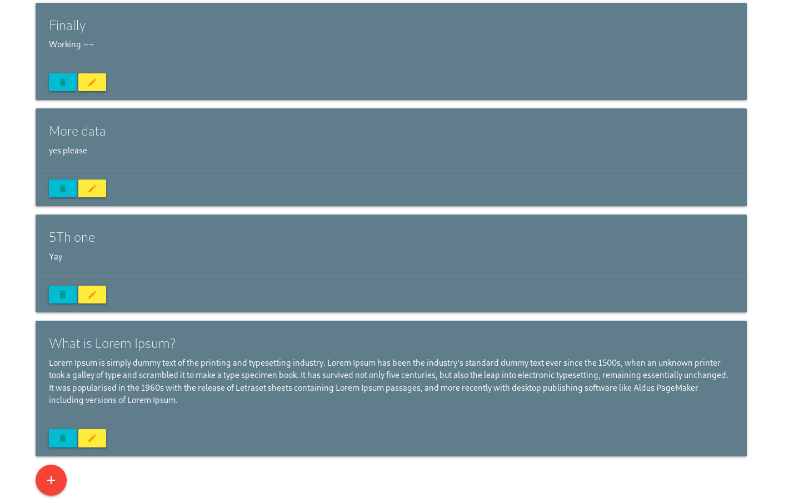

# JSPserveCRUD

This is a simple JSP CRUD application. It a note taking webapp. It can ADD notes, VIEW note, UPDATE notes and DELETE notes (as CRUD app should). The sole purpose of this project is to learn how JSP, POST, GET etc... works. There might be lot of bad practices. Don't use this as reference for anything. If you see any of them please let me know.

## How do I run this?

This project was created in Intellij Idea. This is a learing project so portablity was not my priority. If you want to run this just use Intellij Idea (it's free).

Here is a screenshot

